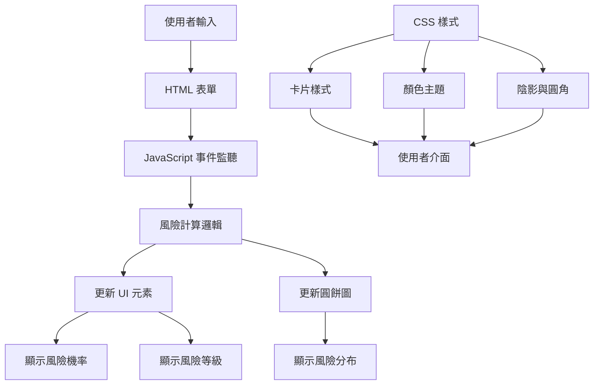

# 茶風險評估工具修正與增強計劃

## 問題分析與解決方案

### 1. JavaScript 事件綁定問題
**問題**: `script.js` 嘗試使用不存在的 ID 選擇元素，導致事件監聽器無法綁定。

**解決方案**:
1. 更新 HTML 為輸入元素添加對應的 ID:
   - `days-since-visit` → 上次到店距今天數的 range input
   - `average-spending` → 平均消費金額的 number input  
   - `visit-frequency` → 到店頻率的 number input
   - `probability-result` → 顯示流失機率的元素
   - `risk-status-label` → 顯示風險狀態標籤的元素

2. 保持即時計算功能，使用 `input` 事件監聽器。

### 2. 風險等級比例圓餅圖
**需求**: 在結果區域顯示當前客戶風險等級比例（安全/警告/危險）。

**解決方案**:
1. 在 HTML 結果區域（流失趨勢分析下方）新增圓餅圖容器。
2. 使用 Chart.js 或純 CSS/SVG 實現圓餅圖。
3. 在 `script.js` 中新增函數計算風險等級比例：
   - 安全: <30%
   - 警告: 30%-60%  
   - 危險: >60%
4. 圓餅圖隨輸入值即時更新。

### 3. CSS 樣式調整
**需求**: 所有卡片有圓角和陰影，優化茶綠色配色。

**解決方案**:
1. **圓角與陰影**:
   - 更新 `style.css` 中的 `.card` 類別：
     ```css
     .card {
       border-radius: 16px;
       box-shadow: 0 8px 24px rgba(86, 125, 70, 0.15);
     }
     ```
   - 為 Tailwind 類別添加自定義陰影。

2. **茶綠色配色優化**:
   - 擴展顏色變數：
     ```css
     :root {
       --primary-green: #567D46;
       --light-green: #E8F0E4;
       --medium-green: #8BA77F;
       --dark-green: #3A5C2E;
       --tea-shadow: rgba(86, 125, 70, 0.2);
     }
     ```
   - 更新按鈕、邊框、背景使用茶綠色系。

## 詳細實施步驟

### 步驟 1: 修正 HTML 元素 ID
1. 在 `index.html` 中為輸入元素添加 ID：
   - 第 98 行: `<input id="days-since-visit" ...>`
   - 第 110 行: `<input id="average-spending" ...>`
   - 第 119 行: `<input id="visit-frequency" ...>`

2. 為結果顯示元素添加 ID：
   - 第 201 行: `<span id="probability-result" ...>78%</span>`
   - 第 188-194 行: 為風險標籤添加 `id="risk-status-label"`

### 步驟 2: 新增圓餅圖區域
1. 在 `index.html` 第 329 行後新增圓餅圖區塊：
```html
<div class="bg-surface-light dark:bg-surface-dark rounded-2xl p-6 shadow-lg border border-gray-100 dark:border-gray-800">
  <div class="flex items-center gap-2 mb-4">
    <span class="material-symbols-outlined text-primary">pie_chart</span>
    <h3 class="font-bold text-text-main dark:text-white text-sm">風險等級分布</h3>
  </div>
  <div class="flex flex-col lg:flex-row items-center gap-6">
    <div class="w-48 h-48 relative">
      <canvas id="riskPieChart"></canvas>
    </div>
    <div class="flex-1">
      <div class="space-y-3">
        <div class="flex items-center justify-between">
          <div class="flex items-center gap-2">
            <div class="w-3 h-3 rounded-full bg-green-500"></div>
            <span class="text-sm text-text-main dark:text-white">安全</span>
          </div>
          <span id="safe-percent" class="font-bold text-text-main dark:text-white">0%</span>
        </div>
        <!-- 類似結構用於警告和危險 -->
      </div>
    </div>
  </div>
</div>
```

2. 在 `index.html` 的 `<head>` 中添加 Chart.js CDN：
```html
<script src="https://cdn.jsdelivr.net/npm/chart.js"></script>
```

### 步驟 3: 更新 JavaScript 功能
1. 擴展 `script.js` 功能：
   - 修正元素選擇器
   - 新增圓餅圖初始化與更新函數
   - 計算風險等級比例

2. 新增圓餅圖相關程式碼：
```javascript
// 初始化圓餅圖
let riskPieChart = null;

function initPieChart() {
  const ctx = document.getElementById('riskPieChart').getContext('2d');
  riskPieChart = new Chart(ctx, {
    type: 'pie',
    data: {
      labels: ['安全', '警告', '危險'],
      datasets: [{
        data: [33, 33, 34],
        backgroundColor: [
          'var(--risk-safe)',
          'var(--risk-warning)', 
          'var(--risk-critical)'
        ],
        borderWidth: 2,
        borderColor: 'var(--white)'
      }]
    },
    options: {
      responsive: true,
      plugins: {
        legend: { display: false },
        tooltip: { enabled: true }
      }
    }
  });
}

// 更新圓餅圖數據
function updatePieChart(probability) {
  if (!riskPieChart) return;
  
  // 計算各風險等級的比例（範例邏輯）
  const safePercent = probability < 30 ? 100 : 0;
  const warningPercent = probability >= 30 && probability <= 60 ? 100 : 0;
  const criticalPercent = probability > 60 ? 100 : 0;
  
  riskPieChart.data.datasets[0].data = [safePercent, warningPercent, criticalPercent];
  riskPieChart.update();
  
  // 更新百分比顯示
  document.getElementById('safe-percent').textContent = `${safePercent}%`;
  document.getElementById('warning-percent').textContent = `${warningPercent}%`;
  document.getElementById('critical-percent').textContent = `${criticalPercent}%`;
}
```

### 步驟 4: 更新 CSS 樣式
1. 更新 `style.css` 中的顏色變數：
```css
:root {
  /* 茶綠色系 */
  --primary-green: #567D46;
  --light-green: #E8F0E4;
  --medium-green: #8BA77F;
  --dark-green: #3A5C2E;
  --tea-shadow: rgba(86, 125, 70, 0.15);
  
  /* 風險狀態色彩 */
  --risk-safe: #4CAF50;
  --risk-warning: #FFC107;
  --risk-critical: #F44336;
  
  /* 其他變數保持不變 */
}
```

2. 增強卡片樣式：
```css
.card {
  background: var(--white);
  border-radius: 16px;
  padding: 24px;
  box-shadow: 0 8px 24px var(--tea-shadow);
  border: 1px solid var(--light-green);
  margin-bottom: 20px;
  transition: transform 0.2s, box-shadow 0.2s;
}

.card:hover {
  transform: translateY(-2px);
  box-shadow: 0 12px 32px rgba(86, 125, 70, 0.25);
}

/* 為 Tailwind 類別添加自定義陰影 */
.shadow-tea {
  box-shadow: 0 8px 24px rgba(86, 125, 70, 0.15);
}
```

## 檔案修改清單

1. **index.html**
   - 為輸入元素添加 ID 屬性
   - 為結果顯示元素添加 ID 屬性
   - 新增圓餅圖 HTML 結構
   - 添加 Chart.js CDN 連結

2. **script.js**
   - 修正元素選擇器
   - 新增圓餅圖初始化與更新函數
   - 整合圓餅圖更新到現有計算流程

3. **style.css**
   - 擴展茶綠色顏色變數
   - 增強卡片圓角與陰影效果
   - 添加懸停效果
   - 優化整體配色一致性

## 預期成果

1. **表單功能正常**: 輸入值變更時即時計算並顯示結果
2. **視覺化增強**: 新增風險等級比例圓餅圖
3. **美觀提升**: 所有卡片具有一致的圓角、陰影和茶綠色配色
4. **使用者體驗改善**: 更直觀的風險視覺化與美觀的介面

## 測試項目

1. 輸入表單功能測試
   - 滑動 range input 是否觸發計算
   - 輸入 number input 是否觸發計算
   - 風險標籤是否正確更新

2. 圓餅圖功能測試
   - 圓餅圖是否正確初始化
   - 風險比例是否隨輸入值更新
   - 百分比顯示是否正確

3. 樣式測試
   - 所有卡片是否具有圓角和陰影
   - 茶綠色配色是否一致應用
   - 響應式設計是否正常

## 技術架構圖



## 後續建議

1. **進階功能**: 可考慮添加多客戶比較功能
2. **數據持久化**: 添加本地儲存保存使用者輸入
3. **響應式優化**: 針對行動裝置進一步優化佈局
4. **動畫效果**: 添加更流暢的過渡動畫

---

**完成標準**: 所有三個需求（表單功能、圓餅圖、CSS 樣式）完全實現且通過測試。